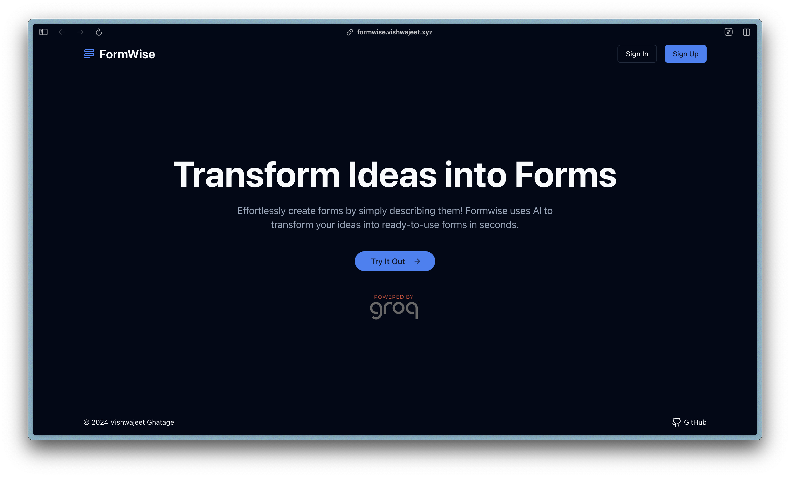

# Formwise

**Formwise** is an AI-powered form builder that uses LLaMA with structured output to transform simple descriptions into ready-to-use forms.

## Getting Started 🚀  
### [Give it a go](https://formwise.vishwajeet.xyz) 💡  


### Key Highlights ✨ 
- **Backend**: **FastAPI** and **MongoDB**(Beanie ODM), for a robust form creation and management API.
- **Frontend**: **Next.js** and **shadcn/ui** for a clean and responsive user interface.
- **AI form generation**: **Langchain** with LLaMA 70B(Groq).
- **Authentication**: Login options with **Google SSO** and **email-password** authentication

## Setup ⚙️

1. **Clone the Repository**:  
```bash
git clone https://github.com/git-vish/formwise.git
cd formwise
```

### Backend 🧩  
2. **Set Up Virtual Environment & Install Dependencies**:
   - **pip**:
     ```bash
     cd backend
     python -m venv .venv
     source .venv/bin/activate
     pip install -r requirements.txt 
     ```
   - **uv**:
     ```bash
     pip install uv
     cd backend
     uv sync --frozen
     source .venv/bin/activate
     ```

3. **Set Up Environment Variables**:  
Copy `.env.example` to `.env` and fill in the required fields.  
```bash
cp .env.example .env
```

4. **Run the Backend**:
```bash
uvicorn src.main:app --reload
```

### Frontend 🖥️  
5. **Install Frontend Dependencies**:
```bash
cd ../frontend
npm install
```

6. **Set Up Environment Variables**:  
Copy `.env.local.example` to `.env.local` and configure API details:
```bash  
cp .env.local.example .env.local  
```

7. **Run the Frontend**:
```bash
npm run dev
```

## License 📜  
This project is licensed under the MIT License. Check the [LICENSE](LICENSE) file for more details.

## Feedback & Contributions 🙌  
Your feedback and contributions are welcome! Please feel free to open an issue or submit a pull request.
